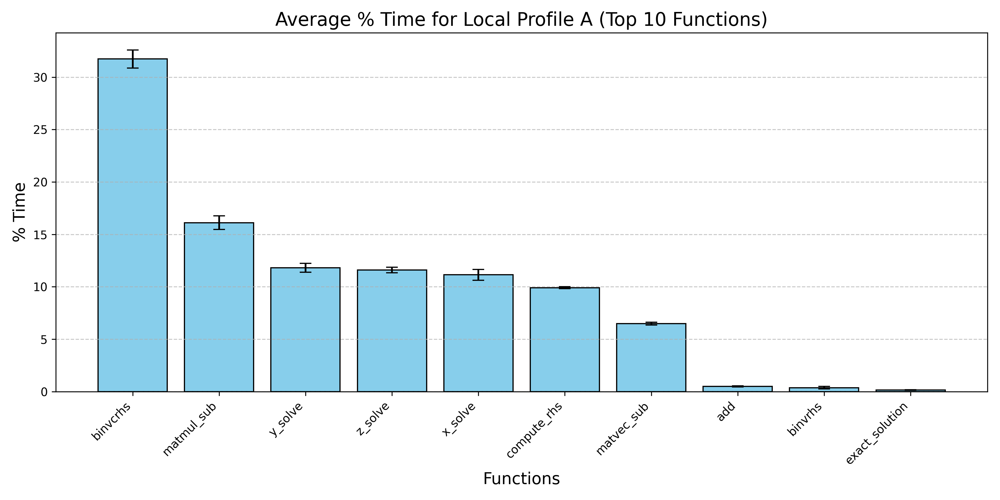
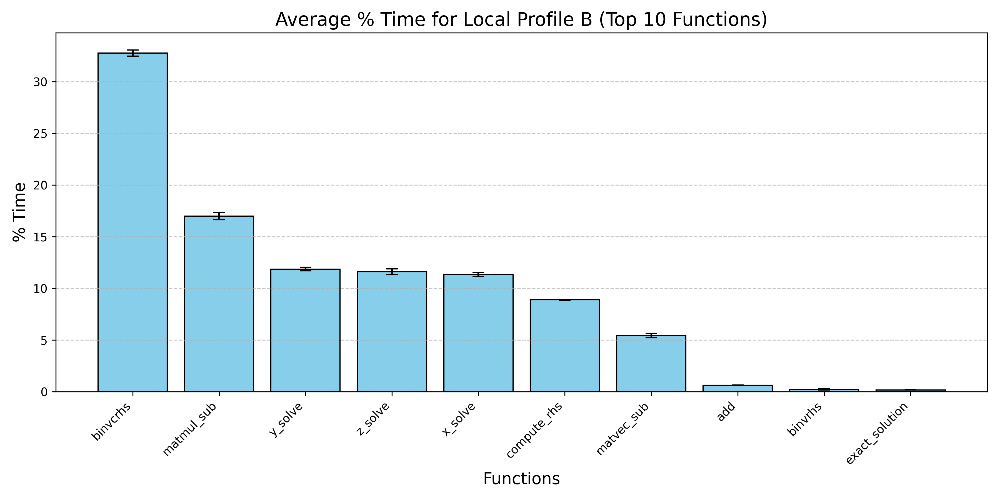
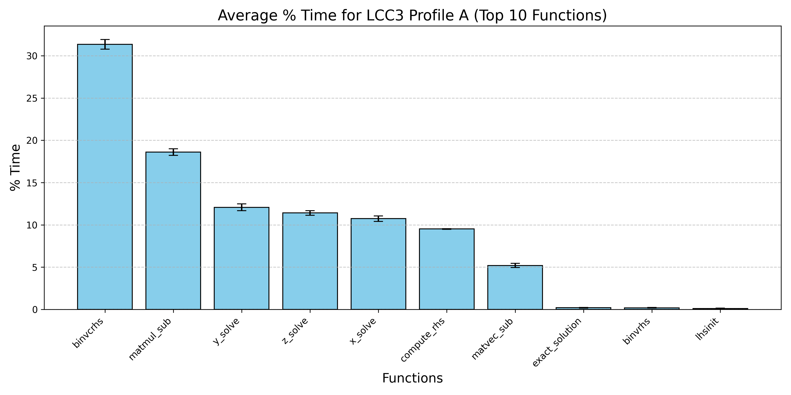
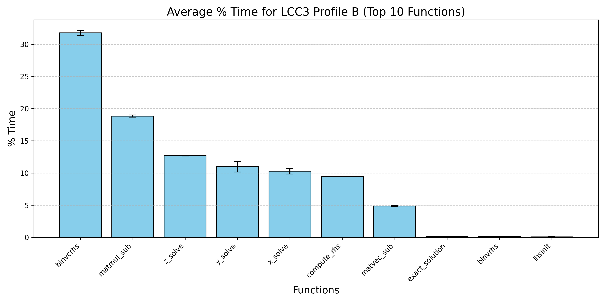

# Exercise 03 - Robert Zacchia

## Task 1 gprof

To enable instrumentation of the programs I had to add the flags -pg to compilation and linking the CMakeList.txt

```
  add_compile_options(-Wall -Wextra -Wno-unknown-pragmas -Wno-unused-parameter -pg)
  set(CMAKE_EXE_LINKER_FLAGS "${CMAKE_EXE_LINKER_FLAGS} -pg")
```
https://gcc.gnu.org/onlinedocs/gcc/Instrumentation-Options.html


>-p
>--profile
>-fprofile
>-pg
>
>    Generate extra code to write profile information suitable for the analysis prof (for -p, --profile, and -fprofile) or gprof (for -pg). You must use this option when compiling the source files you want data about, and you must also use it when linking.
>
>    You can use the function attribute no_instrument_function to suppress profiling of individual functions when compiling with these options. See Common Attributes.

After execution the instrumented program we can output the sampling results into a text file.

```bash
./npb_bt_b
mv gmon.out gmon_b.out
gprof ./npb_bt_b gmon_b.out > profile_b.txt
```

Differences between _a and _b on lcc3.


The main difference between local and lcc3 execution were the overall execution time. There are some differences in percentage and variance.
Interessting is, that z_solve is only on profile B on the lcc3 above the other axis. And there is also the differences between the axis solve algorithms the highest. This could be explained since, the loop order inside z_solve is worse and in profile B the size is 102x102x102 instead of 64x64x64 in a. This makes z_solve to have more cache misses in b than in profile a.
Since the cache on my local machine is higher, we cannot see the same issue here.


| Profile A | Profile B |
|-----------|-----------|
|  |  |
|  |  |


