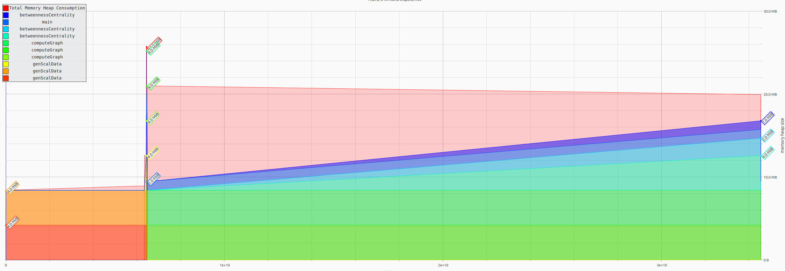

# Exercise 04 - Robert Zacchia

A) Memory profiling
-------------------

 * Use the valgrind "massif" tool in Valgrind to determine the largest sources of heap memory utilization, and visualize the results with "massif-visualizer".

 * How significant is the perturbation in execution time caused by using massif?

As seen in the table below, profiling the memory of a program has a significant overhead. About two times the RAM is allocated just for the profiling, and the execution time is also about double.

| Massif | local (wtime, peak RAM) | lcc3 (wtime, peak RAM) |
|---|---|---|
| without massif | 23.84 s, 26992 kB | 32.29 s, 27364 kB |
| with massif | 40.89 s, 54264 kB | 68.58 s, 56348 kB |

B) Measuring CPU counters
-------------------------

For both programs, measure **all** events in the `[Hardware cache event]` category reported by `perf list`. Note that as discussed in the lecture, there is a limit on the number of hardware counters you can measure in a single run.

For both programs:
 * Report the results in **relative** metrics, and compare these between the programs.
 * How significant is the perturbation in execution time caused by using perf to measure performance counters?
