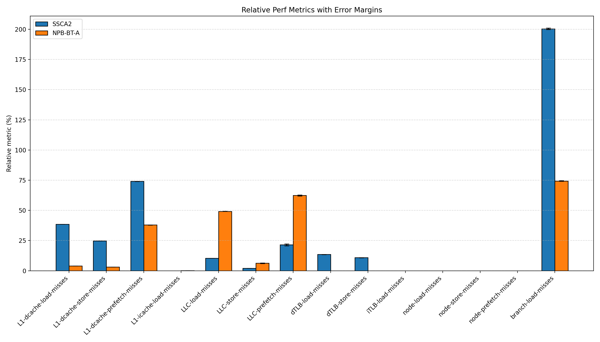

# Exercise 04 - Robert Zacchia

A) Memory profiling
-------------------

 * Use the valgrind "massif" tool in Valgrind to determine the largest sources of heap memory utilization, and visualize the results with "massif-visualizer".

 * How significant is the perturbation in execution time caused by using massif?

As seen in the table below, profiling the memory of a program has a significant overhead. About two times the RAM is allocated just for the profiling, and the execution time is also about double.

| Massif | local (wtime, peak RAM) | lcc3 (wtime, peak RAM) |
|---|---|---|
| without massif | 23.84 s, 26992 kB | 32.29 s, 27364 kB |
| with massif | 40.89 s, 54264 kB | 68.58 s, 56348 kB |

B) Measuring CPU counters
-------------------------

For both programs, measure **all** events in the `[Hardware cache event]` category reported by `perf list`. Note that as discussed in the lecture, there is a limit on the number of hardware counters you can measure in a single run.

cpu information 

Model name:          Intel(R) Xeon(R) CPU           X5650  @ 2.67GHz
CPU MHz:             2793.000
L1d cache:           32K
L1i cache:           32K
L2 cache:            256K
L3 cache:            12288K

## Overview of Hardware cache event counters

### L1 Data Cache (L1-dcache)

- L1-dcache-loads: Number of loads (reads) from main memory into the L1 data cache
- L1-dcache-load-misses: Data cache misses on load operations (data not in L1, must fetch from higher cache levels)
- L1-dcache-stores: Number of stores (writes) to the L1 data cache
- L1-dcache-store-misses: Data cache misses on store operations
- L1-dcache-prefetches: Hardware prefetch requests for the L1 data cache (automatic data fetching ahead of time)
- L1-dcache-prefetch-misses: Prefetch requests that failed to find data in L1
- L1 Instruction Cache (L1-icache)
- L1-icache-loads: Number of instruction fetches from the L1 instruction cache
- L1-icache-load-misses: Instruction cache misses (instruction not in L1, must fetch from higher cache levels)

### Last-Level Cache (LLC) — typically L3 cache

- LLC-loads: Loads from the last-level cache (when L1 misses)
- LLC-load-misses: Misses in the last-level cache (must go to main memory)
- LLC-stores: Stores to the last-level cache
- LLC-store-misses: Store misses in the last-level cache
- LLC-prefetches: Hardware prefetch requests for the LLC
- LLC-prefetch-misses: LLC prefetch requests that failed

### Data TLB (dTLB) — Translation Lookaside Buffer for data access

- dTLB-loads: Virtual-to-physical address translations for loads
- dTLB-load-misses: Address translation misses on loads (must walk page tables)
- dTLB-stores: Virtual-to-physical address translations for stores
- dTLB-store-misses: Address translation misses on stores

### Instruction TLB (iTLB)

- iTLB-loads: Virtual-to-physical address translations for instruction fetches
- iTLB-load-misses: Address translation misses for instructions

### NUMA Node Counters — for multi-socket systems

- node-loads: Memory loads from the local NUMA node
- node-load-misses: Loads that had to access remote NUMA nodes
- node-stores: Memory stores to the local NUMA node
- node-store-misses: Stores to remote NUMA nodes
- node-prefetches: Prefetch requests on local node
- node-prefetch-misses: Prefetches that missed locally

### Branch Prediction

- branch-loads: Total branch instructions executed
- branch-load-misses: Branch prediction misses (incorrect predictions requiring pipeline flushes)

For both programs:
 * Report the results in **relative** metrics, and compare these between the programs.

## Performance Comparison: SSCA2 vs NPB-BT-A

| Metric | SSCA2 | NPB-BT-A |
|--------|-------|----------|
| L1-dcache-load-misses | 38.54% (±0.02%) | 3.98% (±0.11%) |
| L1-dcache-store-misses | 24.75% (±0.00%) | 3.20% (±0.04%) |
| L1-dcache-prefetch-misses | 74.07% (±0.08%) | 37.95% (±0.24%) |
| L1-icache-load-misses | 0.00% (±7.41%) | 0.04% (±1.60%) |
| LLC-load-misses | 10.38% (±0.51%) | 49.23% (±0.32%) |
| LLC-store-misses | 2.11% (±0.94%) | 6.24% (±3.28%) |
| LLC-prefetch-misses | 21.45% (±3.64%) | 62.39% (±0.73%) |
| dTLB-load-misses | 13.50% (±0.23%) | 0.00% (±0.78%) |
| dTLB-store-misses | 10.85% (±0.24%) | 0.0005% (±0.38%) |
| iTLB-load-misses | 0.00% (±8.01%) | 0.00% (±8.95%) |
| node-load-misses | 0.0006% (±40.91%) | 0.0015% (±14.33%) |
| node-store-misses | 0.00% (±0%) | 0.00% (±0%) |
| node-prefetch-misses | 0.008% (±87.61%) | 0.0004% (±337.91%) |
| branch-load-misses | 200.40% (±0.29%) | 74.33% (±0.33%) |

 * How significant is the perturbation in execution time caused by using perf to measure performance counters?

| Run / Counter group | SSCA2 | NPB-BT-A |
|---|---|---|
| L1-dcache | `32.1512 ±0.0514 s` | `76.023 ±0.146 s` |
| L1-icache | `32.317 ±0.179 s` | `76.382 ±0.502 s` |
| LLC | `32.213 ±0.252 s` | `76.476 ±0.135 s` |
| LLC-prefetch | `32.093 ±0.313 s` | `76.002 ±0.118 s` |
| dTLB | `32.2115 ±0.0336 s` | `76.037 ±0.178 s` |
| iTLB | `29.18 ±1.85 s` | `76.947 ±0.724 s` |
| node | `32.4932 ±0.0339 s` | `76.597 ±0.132 s` |
| node-prefetch | `30.25 ±2.03 s` | `75.965 ±0.106 s` |
| branch | `31.431 ±0.734 s` | `76.035 ±0.234 s` |
| baseline (no counters) | `31.673 ±0.862 s` | `76.766 ±0.122 s` |

