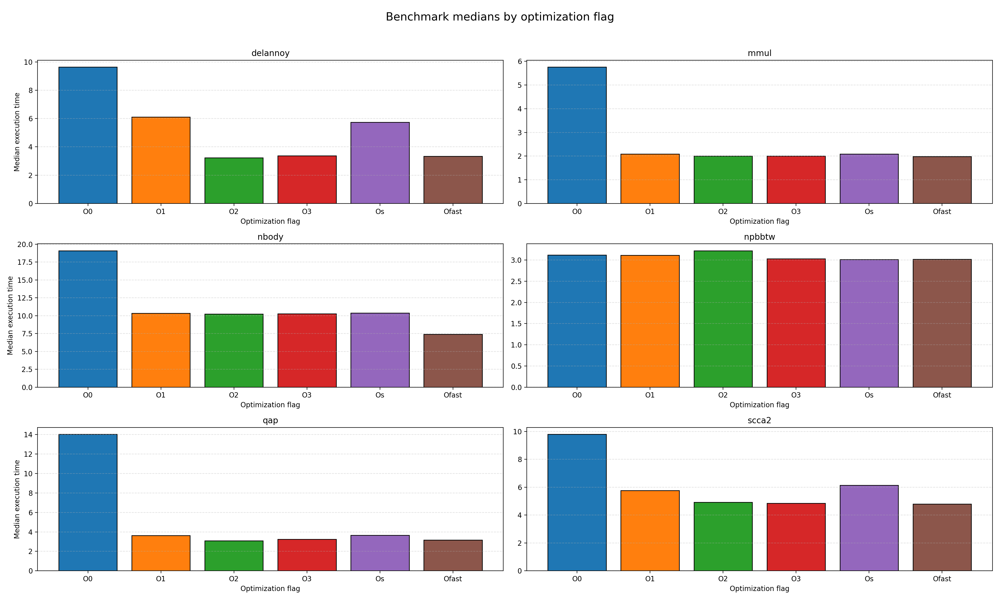
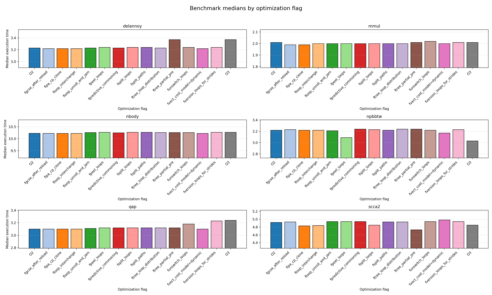

# Exercise 05 - Robert Zacchia


## Task 01





### Table 1: Default optimization levels

<div style="overflow-x: auto; font-size: 12px;">

<table>
<thead>
<tr>
<th>Program</th>
<th>O0</th>
<th>O1</th>
<th>O2</th>
<th>O3</th>
<th>Ofast</th>
<th>Os</th>
</tr>
</thead>
<tbody>

<tr>
<td><b>delannoy</b></td>
<td style="background-color:#f7c5c5;">9.64 (0.34)</td>
<td style="background-color:#f0a8a8;">6.11 (0.22)</td>
<td style="background-color:#9eed9e;">3.23 (0.28)</td>
<td style="background-color:#b6f2b6;">3.37 (0.41)</td>
<td style="background-color:#a8f0a8;">3.33 (0.08)</td>
<td style="background-color:#f5b6b6;">5.73 (0.21)</td>
</tr>

<tr>
<td><b>mmul</b></td>
<td style="background-color:#f7c5c5;">5.76 (0.79)</td>
<td style="background-color:#c8f5c8;">2.09 (3.41)</td>
<td style="background-color:#bdf3bd;">2.01 (3.25)</td>
<td style="background-color:#bdf3bd;">2.01 (3.64)</td>
<td style="background-color:#9eed9e;">1.98 (3.15)</td>
<td style="background-color:#c8f5c8;">2.09 (2.40)</td>
</tr>

<tr>
<td><b>nbody</b></td>
<td style="background-color:#f7c5c5;">19.09 (0.20)</td>
<td style="background-color:#b6f2b6;">10.33 (0.09)</td>
<td style="background-color:#a8f0a8;">10.23 (0.16)</td>
<td style="background-color:#bdf3bd;">10.27 (0.15)</td>
<td style="background-color:#8fe88f;">7.41 (0.28)</td>
<td style="background-color:#c8f5c8;">10.38 (0.20)</td>
</tr>

<tr>
<td><b>qap</b></td>
<td style="background-color:#f7c5c5;">14.01 (0.25)</td>
<td style="background-color:#c8f5c8;">3.63 (0.21)</td>
<td style="background-color:#9eed9e;">3.10 (0.13)</td>
<td style="background-color:#b6f2b6;">3.24 (0.35)</td>
<td style="background-color:#a8f0a8;">3.17 (0.20)</td>
<td style="background-color:#c8f5c8;">3.66 (0.21)</td>
</tr>

<tr>
<td><b>npbbtw</b></td>
<td style="background-color:#bdf3bd;">3.12 (0.35)</td>
<td style="background-color:#b6f2b6;">3.11 (0.20)</td>
<td style="background-color:#c8f5c8;">3.22 (0.23)</td>
<td style="background-color:#a8f0a8;">3.03 (0.41)</td>
<td style="background-color:#9eed9e;">3.02 (0.46)</td>
<td style="background-color:#8fe88f;">3.01 (0.41)</td>
</tr>

</tbody>
</table>

</div>

### Discussion

#### delannoy
- O2 slighlty faster than O3, so cache beheaviour degrades from O2 to O3
#### mmul
 - likely memory bound, since execution time does not decrease after O1
#### nbody
 - same bound as mmul but uses floats instead of integer, thats why Ofast outperforms other optimisations
#### npb_bt_w
 - nearly no impromevements across flags, most likely I/O bound or already optimized code
#### qap
- large optimization difference from O0 to all others => high compute workload O2 slighty better than O3 (same as dellanoy)
#### scca2
- O3 best but barely. 


### Task 02




### Table 2: O2 individual options and O3


<div style="overflow-x: auto; font-size: 12px;">

<table>
<thead>
<tr>
<th>Program</th>
<th>O2</th>
<th>fgcse_after_reload</th>
<th>fipa_cp_clone</th>
<th>floop_interchange</th>
<th>floop_unroll_and_jam</th>
<th>fpeel_loops</th>
<th>fpredictive_commoning</th>
<th>fsplit_loops</th>
<th>fsplit_paths</th>
<th>ftree_loop_distribution</th>
<th>ftree_partial_pre</th>
<th>funswitch_loops</th>
<th>fvect_cost_model</th>
<th>fversion_loops</th>
<th>O3</th>
</tr>
</thead>
<tbody>

<tr>
<td><b>delannoy</b></td>
<td style="background-color:#b6f2b6;">3.23</td>
<td style="background-color:#a8f0a8;">3.22</td>
<td style="background-color:#a8f0a8;">3.22</td>
<td style="background-color:#a8f0a8;">3.22</td>
<td style="background-color:#b6f2b6;">3.23</td>
<td style="background-color:#c8f5c8;">3.24</td>
<td style="background-color:#b6f2b6;">3.23</td>
<td style="background-color:#c8f5c8;">3.24</td>
<td style="background-color:#c8f5c8;">3.24</td>
<td style="background-color:#b6f2b6;">3.23</td>
<td style="background-color:#f5b6b6;">3.37</td>
<td style="background-color:#c8f5c8;">3.24</td>
<td style="background-color:#a8f0a8;">3.22</td>
<td style="background-color:#c8f5c8;">3.24</td>
<td style="background-color:#f5b6b6;">3.37</td>
</tr>

<tr>
<td><b>mmul</b></td>
<td style="background-color:#b6f2b6;">2.01</td>
<td style="background-color:#a8f0a8;">1.99</td>
<td style="background-color:#a8f0a8;">1.99</td>
<td style="background-color:#bdf3bd;">2.00</td>
<td style="background-color:#bdf3bd;">2.00</td>
<td style="background-color:#bdf3bd;">2.00</td>
<td style="background-color:#bdf3bd;">2.00</td>
<td style="background-color:#bdf3bd;">2.00</td>
<td style="background-color:#bdf3bd;">2.00</td>
<td style="background-color:#bdf3bd;">2.00</td>
<td style="background-color:#b6f2b6;">2.01</td>
<td style="background-color:#c8f5c8;">2.02</td>
<td style="background-color:#bdf3bd;">2.00</td>
<td style="background-color:#b6f2b6;">2.01</td>
<td style="background-color:#b6f2b6;">2.01</td>
</tr>

<tr>
<td><b>nbody</b></td>
<td style="background-color:#a8f0a8;">10.23</td>
<td style="background-color:#9eed9e;">10.22</td>
<td style="background-color:#9eed9e;">10.22</td>
<td style="background-color:#9eed9e;">10.22</td>
<td style="background-color:#bdf3bd;">10.26</td>
<td style="background-color:#c8f5c8;">10.27</td>
<td style="background-color:#bdf3bd;">10.25</td>
<td style="background-color:#c8f5c8;">10.27</td>
<td style="background-color:#c8f5c8;">10.27</td>
<td style="background-color:#bdf3bd;">10.26</td>
<td style="background-color:#bdf3bd;">10.26</td>
<td style="background-color:#bdf3bd;">10.26</td>
<td style="background-color:#9eed9e;">10.22</td>
<td style="background-color:#c8f5c8;">10.27</td>
<td style="background-color:#c8f5c8;">10.27</td>
</tr>

<tr>
<td><b>qap</b></td>
<td style="background-color:#9eed9e;">3.10</td>
<td style="background-color:#9eed9e;">3.10</td>
<td style="background-color:#9eed9e;">3.10</td>
<td style="background-color:#9eed9e;">3.10</td>
<td style="background-color:#a8f0a8;">3.11</td>
<td style="background-color:#bdf3bd;">3.12</td>
<td style="background-color:#bdf3bd;">3.12</td>
<td style="background-color:#bdf3bd;">3.12</td>
<td style="background-color:#bdf3bd;">3.12</td>
<td style="background-color:#bdf3bd;">3.12</td>
<td style="background-color:#bdf3bd;">3.12</td>
<td style="background-color:#f0a8a8;">3.18</td>
<td style="background-color:#9eed9e;">3.10</td>
<td style="background-color:#f5b6b6;">3.23</td>
<td style="background-color:#f7c5c5;">3.24</td>
</tr>

<tr>
<td><b>npbbtw</b></td>
<td style="background-color:#bdf3bd;">3.22</td>
<td style="background-color:#c8f5c8;">3.23</td>
<td style="background-color:#bdf3bd;">3.22</td>
<td style="background-color:#bdf3bd;">3.22</td>
<td style="background-color:#b6f2b6;">3.21</td>
<td style="background-color:#9eed9e;">3.09</td>
<td style="background-color:#d6f7d6;">3.24</td>
<td style="background-color:#c8f5c8;">3.23</td>
<td style="background-color:#bdf3bd;">3.22</td>
<td style="background-color:#d6f7d6;">3.24</td>
<td style="background-color:#d6f7d6;">3.24</td>
<td style="background-color:#bdf3bd;">3.22</td>
<td style="background-color:#a8f0a8;">3.17</td>
<td style="background-color:#c8f5c8;">3.23</td>
<td style="background-color:#8fe88f;">3.03</td>
</tr>

</tbody>
</table>

</div>

### Discussion

#### delannoy
- fvect_cost_model
#### mmul
- fgcse_after_reload, fipa_cp_clone
#### nbody
- fgcse_after_reload, fipa_cp_clone, floop_interchange, fvect_cost_model
#### npb_bt_w
 - fpeel_loops
#### qap
 - O2 default is best
#### scca2
- ftree_partial_pre

#### Top 3 Flags

- fvect_cost_model=dynamic, only small improvement but across all programs
    - Controls how GCC decides whether to vectorize loops (SIMD).
    - “dynamic” = runtime decision
    - GCC may generate:
        - a vectorized version of the loop
        - a scalar fallback

- fipa_cp_clone, only small improvement but across all programs
    - copies the special cases of a function into its own function to remove branching
```c
    int foo(int x) {
        if (x == 0) return 1;
        else return x * 2;
    }
    foo(0);
```

```c
    int foo_const_0() {
        return 1;  // branch removed
}
```


- fpeel_loops does only improve npb_bt_w but has the largest single parameter improvement.
    - removes the first or last iterations of a loop if they have conditions checks
    ```c
    for (i = 0; i < n; i++) {
    if (i == 0) special_case();
    work();
    }
    ```
    will be transfomed to
    ```c
    if (n > 0) {
    special_case();
    work();
    }

    for (i = 1; i < n; i++) {
        work();  
    }
    ```
    this way conditions do not get checked in each iterations
